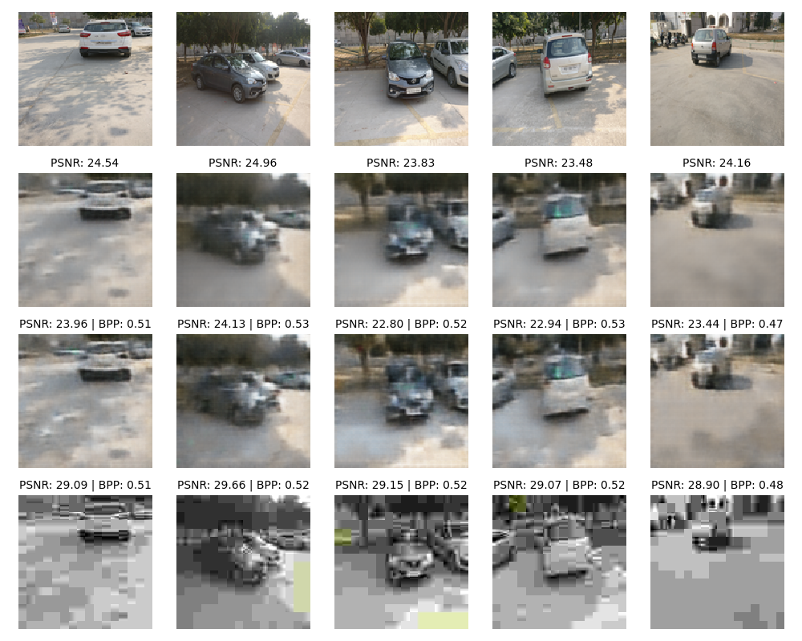
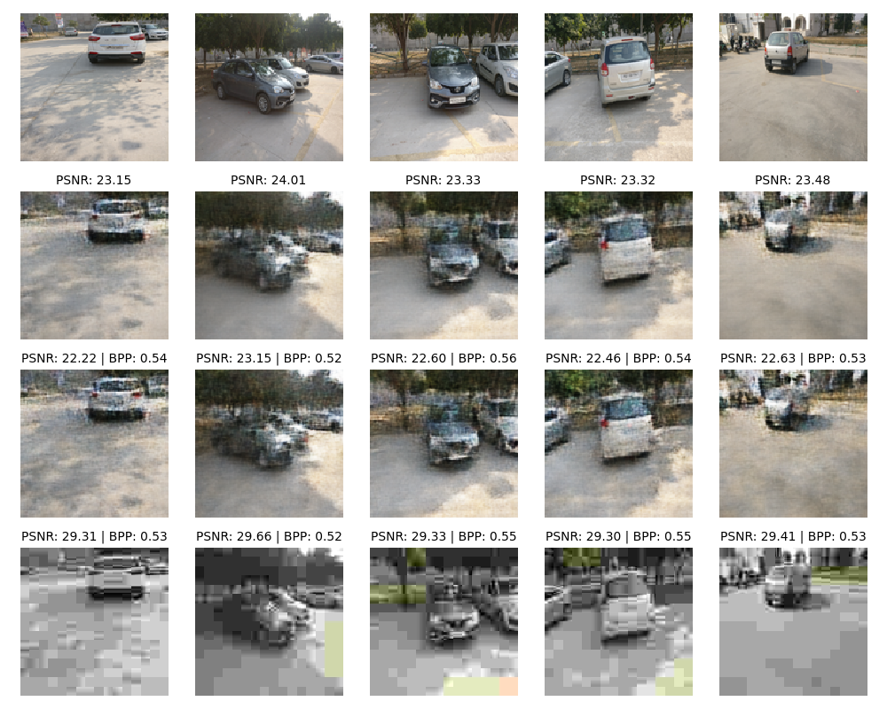
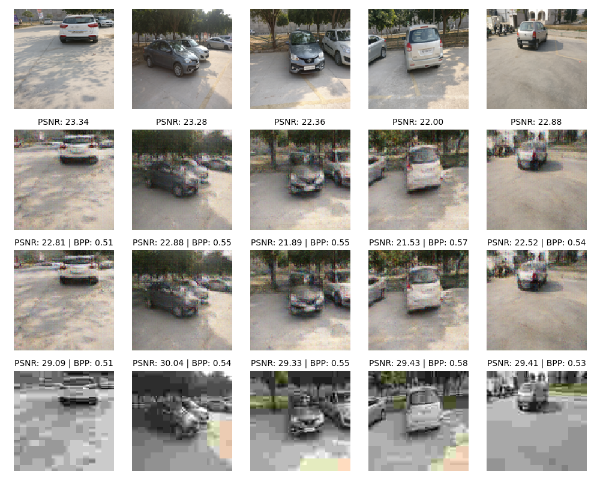
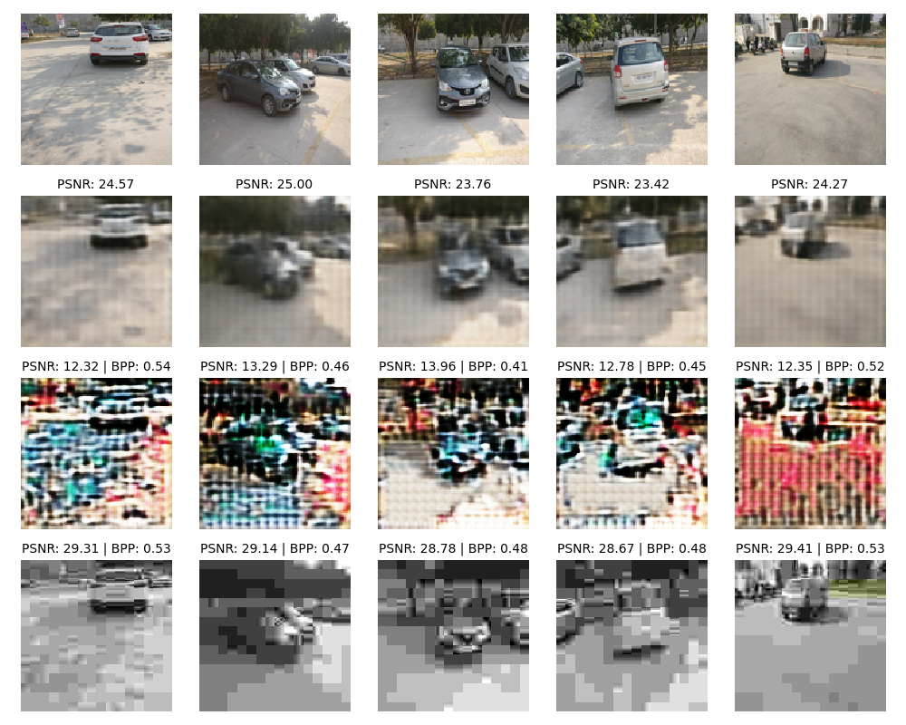

# Отчет: Описание работы кодека для сжатия изображений

## Введение

Целью работы является разработка простого кодека для сжатия изображений размером 128x128 пикселей с использованием автокодировщика, квантования и адаптивного арифметического кодирования (ААК). Этот кодек обучен на наборе изображений, расположенных в папке `./train/`, а результаты демонстрируются на изображениях из папки `./test/`.

## Структура кодера

1. **Слой 1:**
   - Вход: изображение размером 128x128x3.
   - Операции: сверточная операция с ядром 7x7, функция активации ReLU и операция AveragePooling2D с размером окна 2x2.
   - Выход: вектор \( y_1 \) размером 64x64x128.

2. **Слой 2:**
   - Вход: вектор \( y_1 \).
   - Операции: сверточная операция с ядром 5x5, функция активации ReLU и операция AveragePooling2D с размером окна 2x2.
   - Выход: вектор \( y_2 \) размером 32x32x32.

3. **Слой 3:**
   - Вход: вектор \( y_2 \).
   - Операции: сверточная операция с ядром 3x3, функция активации ReLU и операция AveragePooling2D с размером окна 2x2.
   - Выход: вектор \( y_3 \) размером 16x16x16.

4. **Батч-нормализация**: нормализация выходного вектора для улучшения обучения.

5. **Квантование**: 
   - Вычисление максимального значения \( y_{max} = \max_i{y^i_3} \).
   - Квантование по формуле:
     \[
     x_i = \left\lfloor clip\left(\frac{y^i_3}{y_{max}}, [0, 1)\right) \cdot 2^b \right\rfloor,
     \]
     где \( x_i \) принимает значения из множества \( \{0, 1, ..., 2^{b}-1\} \).
   - Результат квантования передается на сжатие с использованием адаптивного арифметического кодирования (ААК).

## Структура декодера

1. **ААК-декодирование**: декодирование последовательности квантованных значений \( x_i \) с использованием ААК.

2. **Обратное преобразование квантования**: восстановление значений \( \hat{y}_3 \) по формуле:
   \[
   \hat{y}^i_3 = y_{max} \cdot \left(\frac{x_i}{2^b} + \frac{1}{2^{b+1}}\right).
   \]

3. **Декодирование**:

   - **Слой 1**: сверточная операция с ядром 3x3 и активацией ReLU. Выход: \( \hat{y}_2 \) размером 32x32x16.
   - **Слой 2**: сверточная операция с ядром 5x5 и активацией ReLU. Выход: \( \hat{y}_1 \) размером 64x64x32.
   - **Слой 3**: сверточная операция с ядром 7x7 и активацией ReLU. Выход: восстановленное изображение \( \hat{x} \) размером 128x128x3.

## Сравнение с JPEG и другими методами

Для сравнения были использованы различные версии автокодировщика и стандарт JPEG. Результаты оценивались по двум метрикам: SSIM (Structural Similarity Index Metric) для оценки качества восстановленного изображения и bpp (бит на пиксель) для оценки эффективности сжатия.

- **RAW**: исходные изображения.
- **AE1**: автокодировщик без добавления шума при обучении.
- **AE2**: автокодировщик с добавлением шума при обучении.
- **JPEG**: алгоритм JPEG, степень сжатия которого подбиралась для достижения качества, близкого к автокодировщикам.

## Улучшения моделей
0. **Base AE**: Базовая версия из условия

1. **Base AE v2**: улучшенная версия базового автокодировщика с использованием:
   - Сверточных слоев с ядром 7x7, 5x5, 3x3.
   - Активации GELU вместо ReLU.
   - Добавление шумов при обучении.
   - Важное изменение — использование MaxPooling для уменьшения размерности и LayerNorm для улучшения сходимости модели.

2. **Residual AE**: архитектура с использованием residual-блоков:
   - В encoder и decoder добавлены residual-блоки, что позволяет более эффективно передавать градиенты при обучении и улучшать восстановление изображений.

3. **GELU AE**: использование GELU-активации вместо ReLU во всех слоях:
   - GELU (Gaussian Error Linear Unit) позволяет более мягко моделировать нелинейные зависимости, что может положительно сказываться на качестве восстановления изображений.

   

4. **custom-loss**: 
   - Дополнительно к использованию стандартной функции потерь, добавлен штраф, который наказывает модель за нежелательные отклонения в значениях на выходе encoder. Работает хуже чем добавление шума. 

## Заключение

Разработанный кодек использует автокодировщик с квантованием и арифметическим кодированием для эффективного сжатия изображений. В ходе экспериментов показано, что предложенные улучшения архитектуры (residual-блоки, использование GELU, шумы при обучении и специальная функция потерь) значительно улучшают качество сжатия и восстановление изображений по сравнению с базовой моделью и JPEG.
